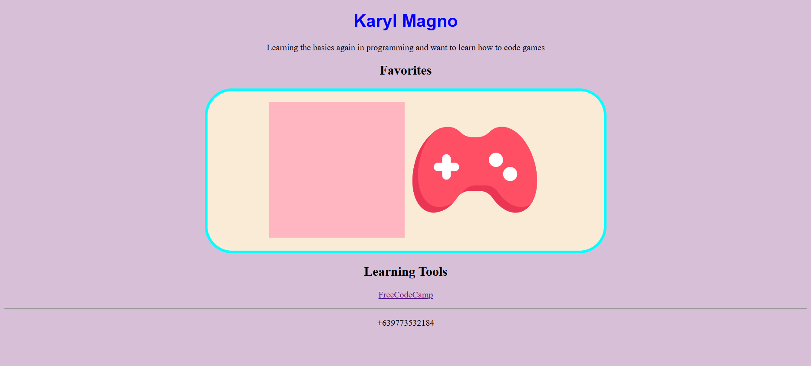

# Intro Card

A beginner-friendly web project that displays a personal introduction card with favorite images and learning resources.  
This project uses basic HTML and CSS concepts such as semantic tags, external stylesheets, and image embedding.

## Features

- Personal introduction section
- Favorites gallery with images
- List of learning tools with external link
- Custom styling with CSS

## How to View

1. Clone or download this repository.
2. Make sure `pink.webp` and `games.png` are in the same folder as `index.html`.
3. Open `index.html` in your browser.

## Demo

## Technologies Used

- HTML5
- CSS3

## Author

Karyl Magno
